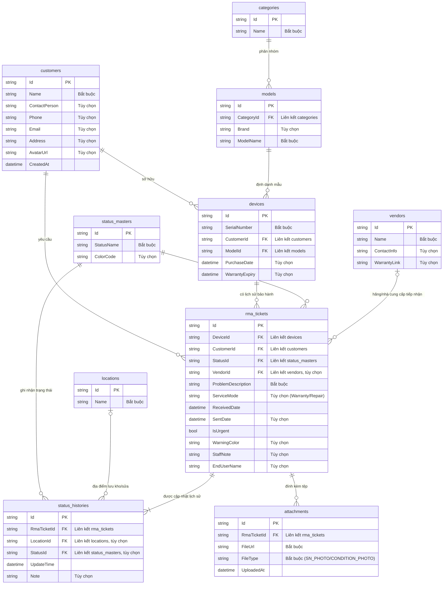

# Sơ đồ ERD Hệ thống SongLinhRMA

Tài liệu này cung cấp sơ đồ ERD (Entity-Relationship Diagram) hoàn chỉnh cho dự án **SongLinhRMA**. 

Mặc dù dự án sử dụng cơ sở dữ liệu NoSQL **Google Cloud Firestore** (lưu trữ theo dạng Document-oriented), cấu trúc dữ liệu trong ứng dụng vẫn được thiết kế và liên kết chặt chẽ theo dạng quan hệ (Relational) thông qua các trường ID tham chiếu chéo giữa các Collection.

> [!NOTE]
> Thực thể `ComponentChecklist` đã bị loại bỏ khỏi sơ đồ ERD này do đây là lớp thực thể cũ thuộc SQL Server và không được đăng ký hay sử dụng trong cấu hình lưu trữ Firestore của ứng dụng hiện tại.

---

## 1. Sơ đồ Mermaid ERD

Dưới đây là sơ đồ quan hệ thực thể mô tả cấu trúc của **10 Collection** trong cơ sở dữ liệu Firestore:

---

## 2. Chi tiết cấu trúc dữ liệu (Data Dictionary)

Dưới đây là chi tiết thuộc tính của từng Collection được cấu hình bằng các thuộc tính `[FirestoreData]`, `[FirestoreDocumentId]` và `[FirestoreProperty]`.

### 2.1. Collection: `customers` (Khách hàng)
Lưu trữ thông tin liên hệ của các đại lý, khách hàng doanh nghiệp hoặc cá nhân.

| Trường (Field) | Kiểu dữ liệu | Ràng buộc | Mô tả |
| :--- | :--- | :--- | :--- |
| `Id` | `string` | PK, FirestoreDocumentId | Mã định danh duy nhất của khách hàng |
| `Name` | `string` | Bắt buộc, tối đa 255 ký tự | Tên khách hàng hoặc tên công ty |
| `ContactPerson` | `string` | Tùy chọn, tối đa 255 ký tự | Người liên hệ đại diện |
| `Phone` | `string` | Tùy chọn, tối đa 20 ký tự | Số điện thoại liên lạc |
| `Email` | `string` | Tùy chọn, tối đa 255 ký tự | Địa chỉ thư điện tử |
| `Address` | `string` | Tùy chọn, tối đa 500 ký tự | Địa chỉ giao nhận hàng |
| `AvatarUrl` | `string` | Tùy chọn, tối đa 500 ký tự | Ảnh đại diện của khách hàng |
| `CreatedAt` | `DateTime` | Mặc định: Giờ hiện tại | Thời gian tạo tài khoản khách hàng |

### 2.2. Collection: `devices` (Thiết bị)
Thông tin các thiết bị cụ thể được quản lý trong hệ thống, xác định qua Serial Number.

| Trường (Field) | Kiểu dữ liệu | Ràng buộc | Mô tả |
| :--- | :--- | :--- | :--- |
| `Id` | `string` | PK, FirestoreDocumentId | Mã định danh duy nhất của thiết bị |
| `SerialNumber` | `string` | Bắt buộc, tối đa 100 ký tự | Số sê-ri của thiết bị (S/N) |
| `CustomerId` | `string` | FK (`customers.Id`), Bắt buộc | ID khách hàng sở hữu thiết bị |
| `ModelId` | `string` | FK (`models.Id`), Bắt buộc | ID model của thiết bị |
| `PurchaseDate` | `DateTime?` | Tùy chọn | Ngày mua hàng |
| `WarrantyExpiry` | `DateTime?` | Tùy chọn | Ngày hết hạn bảo hành |

### 2.3. Collection: `models` (Dòng sản phẩm)
Phân loại các Model sản phẩm chi tiết.

| Trường (Field) | Kiểu dữ liệu | Ràng buộc | Mô tả |
| :--- | :--- | :--- | :--- |
| `Id` | `string` | PK, FirestoreDocumentId | Mã định danh duy nhất của Model |
| `CategoryId` | `string` | FK (`categories.Id`), Bắt buộc | ID phân loại danh mục của model |
| `Brand` | `string?` | Tùy chọn, tối đa 100 ký tự | Thương hiệu sản xuất (Dell, Apple, Asus...) |
| `ModelName` | `string` | Bắt buộc, tối đa 255 ký tự | Tên dòng sản phẩm |

### 2.4. Collection: `categories` (Danh mục sản phẩm)
Danh mục sản phẩm lớn giúp gom nhóm thiết bị.

| Trường (Field) | Kiểu dữ liệu | Ràng buộc | Mô tả |
| :--- | :--- | :--- | :--- |
| `Id` | `string` | PK, FirestoreDocumentId | Mã định danh duy nhất của Danh mục |
| `Name` | `string` | Bắt buộc, tối đa 100 ký tự | Tên danh mục (PC, Laptop, UPS, Printer...) |

### 2.5. Collection: `vendors` (Hãng bảo hành / Nhà cung cấp)
Lưu thông tin các hãng tiếp nhận bảo hành ủy quyền của sản phẩm.

| Trường (Field) | Kiểu dữ liệu | Ràng buộc | Mô tả |
| :--- | :--- | :--- | :--- |
| `Id` | `string` | PK, FirestoreDocumentId | Mã định danh hãng bảo hành |
| `Name` | `string` | Bắt buộc, tối đa 150 ký tự | Tên hãng (Dell Service, Apple Service...) |
| `ContactInfo` | `string?` | Tùy chọn, tối đa 500 ký tự | Địa chỉ, số hotline bảo hành hãng |
| `WarrantyLink` | `string?` | Tùy chọn, tối đa 500 ký tự | Link tra cứu S/N trên website hãng |

### 2.6. Collection: `status_masters` (Danh mục trạng thái RMA)
Quản lý các bước trong quy trình xử lý phiếu RMA.

| Trường (Field) | Kiểu dữ liệu | Ràng buộc | Mô tả |
| :--- | :--- | :--- | :--- |
| `Id` | `string` | PK, FirestoreDocumentId | Mã định danh trạng thái |
| `StatusName` | `string` | Bắt buộc, tối đa 100 ký tự | Tên trạng thái (Chờ duyệt, Đã nhận sửa, Đã trả...) |
| `ColorCode` | `string?` | Tùy chọn, tối đa 20 ký tự | Mã màu Hex biểu diễn trên giao diện (ví dụ: `#FF0000`) |

### 2.7. Collection: `locations` (Địa điểm)
Vị trí lưu kho vật lý hoặc nơi xử lý sản phẩm.

| Trường (Field) | Kiểu dữ liệu | Ràng buộc | Mô tả |
| :--- | :--- | :--- | :--- |
| `Id` | `string` | PK, FirestoreDocumentId | Mã định danh vị trí |
| `Name` | `string` | Bắt buộc, tối đa 150 ký tự | Tên vị trí (Tại Cty, Tại Hãng, Kho A, Kho B...) |

### 2.8. Collection: `rma_tickets` (Phiếu RMA / Phiếu bảo nhận trả)
Thực thể trung tâm lưu thông tin yêu cầu dịch vụ sửa chữa bảo hành thiết bị.

| Trường (Field) | Kiểu dữ liệu | Ràng buộc | Mô tả |
| :--- | :--- | :--- | :--- |
| `Id` | `string` | PK, FirestoreDocumentId | Mã định danh phiếu RMA |
| `DeviceId` | `string` | FK (`devices.Id`), Bắt buộc | ID thiết bị cần sửa chữa |
| `CustomerId` | `string` | FK (`customers.Id`), Bắt buộc | ID khách hàng gửi bảo hành |
| `StatusId` | `string` | FK (`status_masters.Id`), Bắt buộc | ID trạng thái xử lý hiện tại |
| `VendorId` | `string?` | FK (`vendors.Id`), Tùy chọn | ID hãng tiếp nhận bảo hành (nếu gửi đi hãng) |
| `ProblemDescription` | `string` | Bắt buộc, tối đa 2000 ký tự | Mô tả chi tiết lỗi thiết bị |
| `ServiceMode` | `string?` | Tùy chọn, tối đa 100 ký tự | Chế độ sửa chữa (`Warranty` hoặc `Repair`) |
| `ReceivedDate` | `DateTime` | Mặc định: Giờ hiện tại | Ngày tiếp nhận thiết bị từ khách hàng |
| `SentDate` | `DateTime?` | Tùy chọn | Ngày chuyển tiếp thiết bị đi hãng/sửa ngoài |
| `IsUrgent` | `bool` | Mặc định: `false` | Đánh dấu yêu cầu xử lý gấp |
| `WarningColor` | `string?` | Tùy chọn | Màu sắc cảnh báo quá hạn SLA (ví dụ: Yellow, Red) |
| `StaffNote` | `string?` | Tùy chọn, tối đa 2000 ký tự | Ghi chú nội bộ của nhân viên kỹ thuật |
| `EndUserName` | `string?` | Tùy chọn, tối đa 500 ký tự | Tên khách hàng cuối sử dụng sản phẩm |

### 2.9. Collection: `status_histories` (Lịch sử cập nhật phiếu)
Theo dõi nhật ký thay đổi trạng thái và vị trí của phiếu RMA qua các mốc thời gian.

| Trường (Field) | Kiểu dữ liệu | Ràng buộc | Mô tả |
| :--- | :--- | :--- | :--- |
| `Id` | `string` | PK, FirestoreDocumentId | Mã định danh bản ghi lịch sử |
| `RmaTicketId` | `string` | FK (`rma_tickets.Id`), Bắt buộc | ID phiếu RMA được cập nhật |
| `LocationId` | `string?` | FK (`locations.Id`), Tùy chọn | ID địa điểm mới sau cập nhật |
| `StatusId` | `string?` | FK (`status_masters.Id`), Tùy chọn | ID trạng thái mới sau cập nhật |
| `UpdateTime` | `DateTime` | Mặc định: Giờ hiện tại | Thời gian thực hiện cập nhật |
| `Note` | `string?` | Tùy chọn, tối đa 1000 ký tự | Ghi chú chi tiết cho lần cập nhật này |

### 2.10. Collection: `attachments` (Tệp đính kèm)
Các tệp tin, hình ảnh chụp tình trạng thiết bị hoặc nhãn S/N được tải lên hệ thống.

| Trường (Field) | Kiểu dữ liệu | Ràng buộc | Mô tả |
| :--- | :--- | :--- | :--- |
| `Id` | `string` | PK, FirestoreDocumentId | Mã định danh tệp đính kèm |
| `RmaTicketId` | `string` | FK (`rma_tickets.Id`), Bắt buộc | ID phiếu RMA sở hữu hình ảnh/tệp |
| `FileUrl` | `string` | Bắt buộc, tối đa 1000 ký tự | Đường dẫn URL đến tệp trên bộ lưu trữ đám mây |
| `FileType` | `string` | Bắt buộc, tối đa 100 ký tự | Loại tệp phân biệt chụp S/N (`SN_PHOTO`) hoặc ngoại quan (`CONDITION_PHOTO`) |
| `UploadedAt` | `DateTime` | Mặc định: Giờ hiện tại | Thời gian đăng tải tệp |
