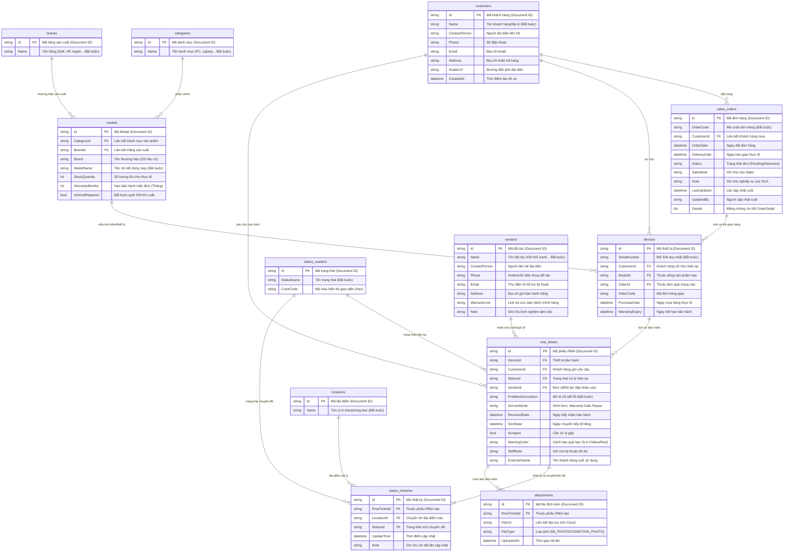
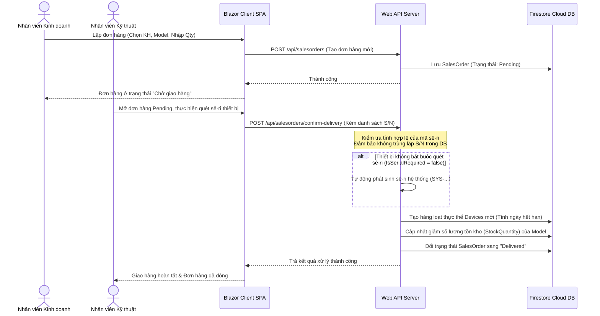

# 🚀 SOLICOM RMA & Delivery ERP System

Hệ thống ERP thu nhỏ quản lý quy trình **Giao Hàng (Sales Delivery)** và **Bảo Hành (RMA - Return Merchandise Authorization)** chuyên nghiệp của công ty **Song Linh (SOLICOM)**. Dự án được phát triển dựa trên kiến trúc phân tách Client - Server hiện đại, cơ sở dữ liệu đám mây thời gian thực tốc độ cao, hỗ trợ tự động tính toán hạn mức SLA, nhận diện ký tự quang học (OCR) mã vạch và giám sát quota Firestore thông minh.

Tài liệu này được thiết kế để làm tài liệu Onboarding dự án cũng như giới thiệu tổng quan kiến trúc kỹ thuật dành cho ứng viên/lập trình viên mới tham gia.

---

## 🛠️ 1. Công nghệ sử dụng (Tech Stack)

Hệ thống được thiết kế tối ưu hóa chi phí vận hành đám mây, tận dụng tối đa các tài nguyên miễn phí (Free Tier) nhưng vẫn đảm bảo độ ổn định cao trên môi trường Production.

*   **Backend (RMA.Server):**
    *   **Framework:** ASP.NET Core Web API (.NET 10.0)
    *   **Database SDK:** Google Cloud Firestore Admin SDK
    *   **Authentication:** Firebase Auth & JWT Bearer Token (kèm cơ chế Bypass Local cho nhà phát triển)
    *   **OCR & Imaging:** Google Cloud Vision OCR kết hợp Tesseract OCR (trích xuất S/N từ hình ảnh thiết bị)
    *   **Background Jobs:** Hosted Service tuần kỳ kiểm tra SLA quá hạn và cảnh báo quá tải Firestore.
*   **Frontend (RMA.Client):**
    *   **Framework:** Blazor WebAssembly (WASM) Single Page Application (.NET 10.0)
    *   **UI Library:** MudBlazor Component Library (Visual Theme chuẩn mực công nghiệp)
    *   **Realtime:** SignalR Client kết nối đồng bộ trạng thái giao nhận và xử lý vé bảo hành.
*   **Cơ sở dữ liệu (Database):**
    *   **Google Cloud Firestore:** Hệ quản trị cơ sở dữ liệu NoSQL dạng Document-oriented thế hệ mới, lưu trữ phân tán, phản hồi thời gian thực.
*   **Hạ tầng & Triển khai (DevOps):**
    *   **Containerization:** Docker & Docker Compose
    *   **Hosting:** Firebase Hosting (Frontend SPA) + Render.com (Backend API Web Service)
    *   **CI/CD:** GitHub Actions tự động hóa kiểm thử và deploy.

---

## 🏛️ 2. Kiến trúc mã nguồn (Clean Architecture & 3-Tier)

Hệ thống được tổ chức thành 4 dự án độc lập, phân chia rạch ròi trách nhiệm (Separation of Concerns):

```text
SongLinhRMA.System/
├── RMA.Client/         # Presentation Layer (Blazor WASM)
│   ├── Pages/          # Giao diện nghiệp vụ (Dashboard, Tickets, Devices, Customers)
│   ├── Services/       # API Services giao tiếp với Backend
│   ├── Shared/         # Component dùng chung (Dialogs, Grids)
│   └── Layout/         # Layout hệ thống phân quyền (Admin, Tech, Sales Layout)
│
├── RMA.Server/         # Core & Infrastructure Layer (ASP.NET Core Web API)
│   ├── Controllers/    # Các REST Endpoints kiểm soát truy cập và phân quyền
│   ├── Entities/       # Thực thể dữ liệu Firestore (Data Models)
│   ├── Services/       # Nghiệp vụ lõi (FirestoreRepository, OCR Service, SLA Background Worker)
│   └── serviceAccountKey.json # Credentials kết nối Firebase (Local/Prod)
│
├── RMA.Shared/         # Application Contract Layer (DTOs & Utilities)
│   ├── DTOs/           # Data Transfer Objects trao đổi giữa Client và Server
│   └── Helpers/        # Các hàm xử lý chuỗi, định dạng và tính toán chung
│
└── RMA.Server.Tests/   # Testing Layer (xUnit)
    ├── SlaTests/       # Kiểm thử tự động logic tính toán màu cảnh báo quá hạn
    └── Controllers/    # Mock Repository để kiểm thử Endpoints tích hợp
```

---

## 📋 3. Đặc tả Use Case cốt lõi

### Use Case 1: Tạo Đơn Hàng & Xác Nhận Giao Hàng (Sales & Delivery)
*   **Tác nhân:** Nhân viên Kinh doanh (Sales) & Nhân viên Kỹ thuật (Tech).
*   **Mô tả:** Phòng Sales tạo đơn hàng ở dạng tạm khóa (`Pending`). Phòng Tech sau đó mở hộp thoại giao hàng, quét hoặc nhập số sê-ri (**Serial Number - S/N**) cho các dòng sản phẩm bắt buộc quản lý S/N, hệ thống sẽ tự sinh sê-ri cho thiết bị phụ trợ (như cáp, đầu nguồn) và chuyển trạng thái đơn hàng thành `Delivered`, tự động kích hoạt thời hạn bảo hành.

### Use Case 2: Kiểm Tra Trùng Lặp & Cảnh Báo SLA Vé Bảo Hành (RMA SLA Process)
*   **Tác nhân:** Nhân viên Kỹ thuật (Tech).
*   **Mô tả:** Khi khách hàng gửi yêu cầu bảo hành, Tech nhập S/N của thiết bị. Hệ thống sẽ tự động quét chéo xem S/N này có đang nằm trong một vé RMA nào chưa hoàn tất hay không nhằm ngăn ngừa trùng lặp. Dựa trên mức độ khẩn cấp (`IsUrgent`) và ngày tiếp nhận, một Background Worker sẽ tính toán và phân loại cảnh báo:
    *   **Xanh (Safe):** Thời gian xử lý còn nhiều.
    *   **Vàng (Warning):** Vé RMA sắp chạm mốc quá hạn xử lý quy định.
    *   **Đỏ (Alert):** Vé đã quá hạn xử lý (SLA vi phạm).

### Use Case 3: Giám Sát Tài Nguyên Hạn Mức Firestore (Firestore Quota Monitoring)
*   **Tác nhân:** Quản trị viên (Admin).
*   **Mô tả:** Để tránh vượt quá hạn mức miễn phí của Google Firestore (50,000 lượt đọc và 20,000 lượt ghi mỗi ngày), trang Admin Dashboard tích hợp một panel Giám sát thời gian thực số lượt truy vấn của toàn hệ thống, tự động tính toán đếm ngược thời gian reset quota của Firebase và đưa ra mức cảnh báo trực quan trước khi chạm ngưỡng giới hạn.

---

## 📊 4. Sơ Đồ Kiến Trúc & Cơ Sở Dữ Liệu

Mặc dù hệ thống lưu trữ trên cơ sở dữ liệu NoSQL **Google Cloud Firestore** (dưới dạng Document-oriented), cấu trúc và thiết kế thực tế của Song Linh RMA vẫn được xây dựng và liên kết chặt chẽ theo dạng quan hệ (Relational) thông qua các khóa ngoại tham chiếu chéo (`Id` $\leftrightarrow$ `Foreign Key`).

Dưới đây là sơ đồ Mermaid ERD chính xác 100% khớp với cấu trúc thực thể (Entity C# Classes) trong dự án `RMA.Server`:



---

## 🔄 5. Luồng xử lý Giao hàng & Bảo hành (Sequence Diagram)

Dưới đây mô tả luồng đồng bộ giữa vai trò Kinh doanh (Sales) lập đơn hàng và Kỹ thuật (Tech) xác thực xuất kho kèm kích hoạt bảo hành tự động:



---

## 🚀 6. Hướng dẫn Triển khai & Khởi chạy (Deployment Guide)

### 6.1. Thiết lập trên máy phát triển (Local Development)

#### Bước 1: Chuẩn bị Credentials Firebase
Hệ thống sử dụng Firestore Service Account Key để truy cập cơ sở dữ liệu.
1. Truy cập **Firebase Console** $\rightarrow$ **Project Settings** $\rightarrow$ **Service Accounts** $\rightarrow$ Chọn **Generate new private key**.
2. Tải file private key dạng JSON về máy, đổi tên thành **`serviceAccountKey.json`**.
3. Lưu tệp tin này vào thư mục: `SongLinhRMA.System/RMA.Server/serviceAccountKey.json`.

#### Bước 2: Chạy hệ thống đồng thời bằng dotnet CLI
Mở terminal tại thư mục gốc của dự án:
```bash
# 1. Chạy dự án Backend Web API (Cổng chạy mặc định: http://localhost:5299)
dotnet run --project RMA.Server/RMA.Server.csproj --launch-profile http

# 2. Mở một terminal mới và chạy dự án Blazor WASM Client
dotnet run --project RMA.Client/RMA.Client.csproj
```

---

### 6.2. Thiết lập Đường hầm Kêt nối (Cloudflare Tunnel)
Để kiểm thử ứng dụng chạy trực tuyến trên Firebase Hosting gọi về API Server đang chạy ở máy Local của bạn:
1. Cài đặt **`cloudflared`** trên máy tính cá nhân.
2. Mở terminal và tạo đường hầm trỏ về cổng API Backend:
   ```bash
   cloudflared tunnel --url http://localhost:5299
   ```
3. Sao chép địa chỉ công khai có dạng `https://xxxx.trycloudflare.com` được sinh ra.
4. Dán địa chỉ đó vào cấu hình `ApiBaseUrl` của tệp **`RMA.Client/wwwroot/appsettings.json`** (Đảm bảo có dấu `/` ở cuối):
   ```json
   {
     "ApiBaseUrl": "https://xxxx.trycloudflare.com/"
   }
   ```
5. Thực hiện Build và Deploy lại Client lên Firebase.

---

### 6.3. Triển khai lên môi trường Production (Cloud Deployment)

#### A. Triển khai Frontend lên Firebase Hosting
1. Cài đặt Firebase CLI (nếu chưa có):
   ```bash
   npm install -g firebase-tools
   ```
2. Đăng nhập tài khoản Firebase:
   ```bash
   firebase login
   ```
3. Build dự án Blazor WASM sang dạng static files tối ưu:
   ```bash
   dotnet publish RMA.Client/RMA.Client.csproj -c Release -o release
   ```
4. Đẩy tài nguyên lên Firebase Hosting:
   ```bash
   firebase deploy --only hosting --project onglinh-rma-production
   ```

#### B. Triển khai Backend lên Render.com (Tự động thông qua Git)
Backend được cấu hình tự động triển khai (Continuous Deployment) khi có commit mới trên nhánh `main` của GitHub:
1. Đăng nhập vào **Render.com**, tạo một **Web Service** mới liên kết với repository của bạn.
2. Thiết lập các thông số cơ bản:
   * **Runtime:** `Docker`
   * **Branch:** `main`
   * **Plan:** `Free` (Có cơ chế Spin Down ngủ đông sau 15 phút không hoạt động).
3. Thêm file JSON cấu hình bảo mật thông qua **Secret File**:
   * Tạo một Secret File có tên là `serviceAccountKey.json` trên Render Dashboard.
   * Dán toàn bộ nội dung file JSON key Firebase của bạn vào đây. Hệ thống Docker sẽ tự động đọc file này khi khởi động.