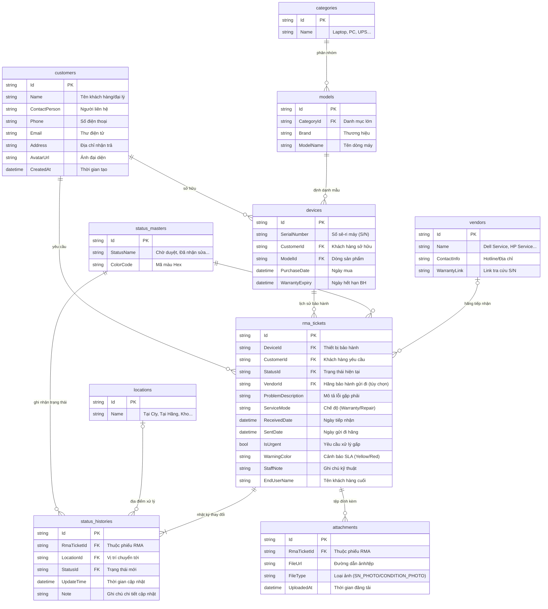
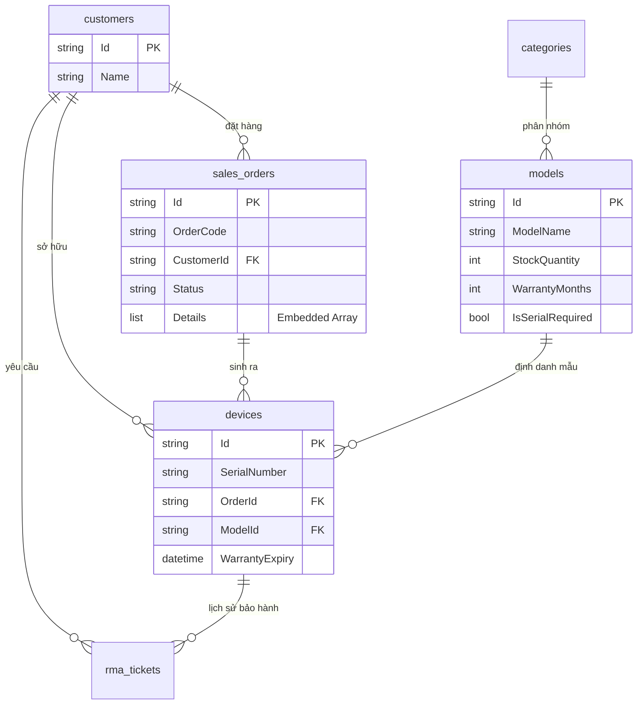
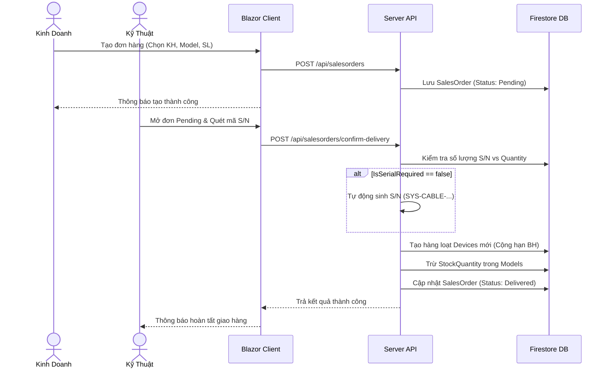
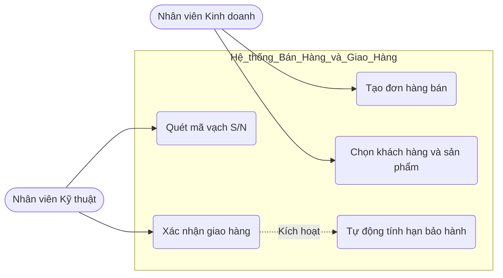
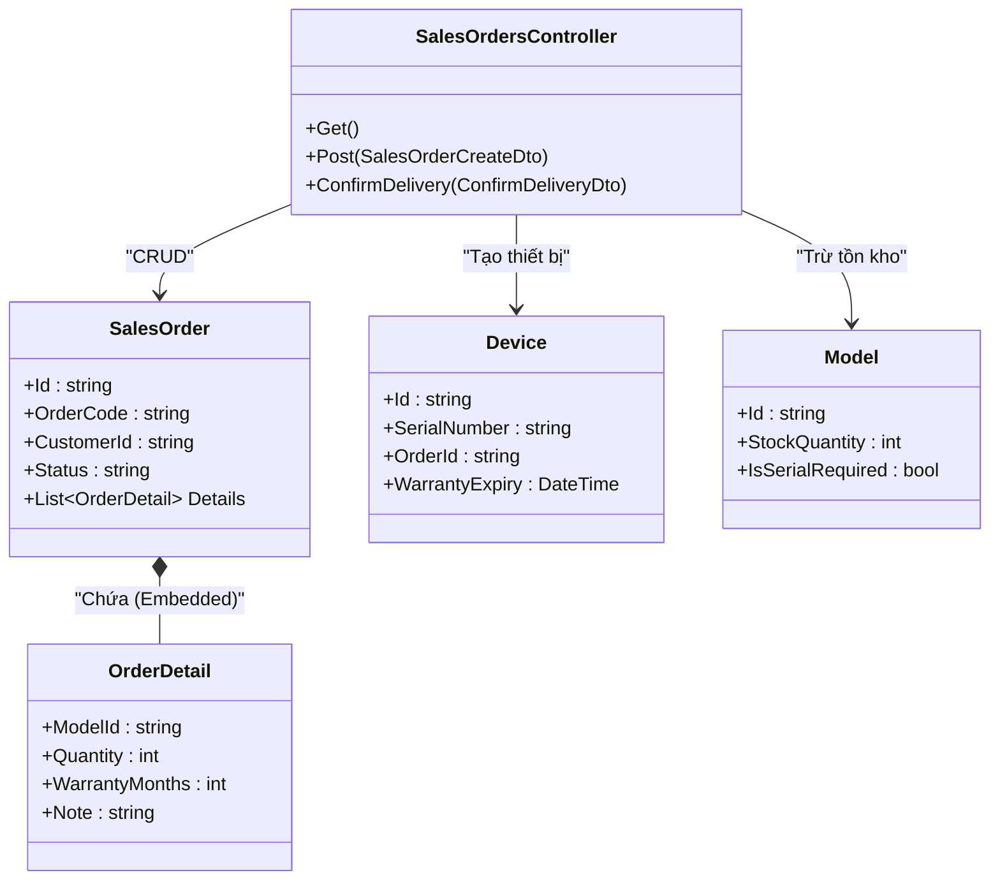
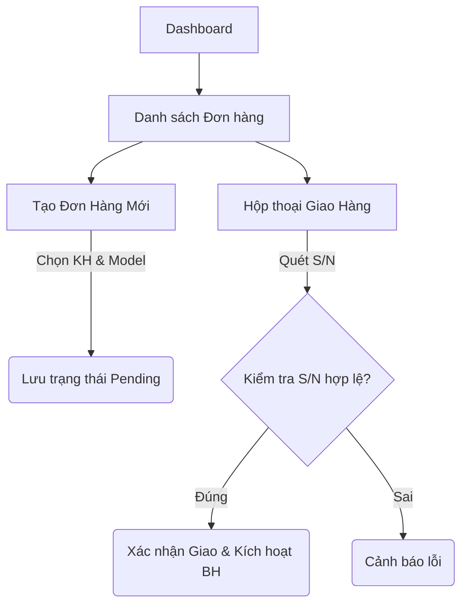

# SongLinhRMA.System

Hệ thống quản lý quy trình bảo hành (RMA - Return Merchandise Authorization) chuyên nghiệp cho doanh nghiệp **SongLinh**. Dự án được xây dựng dựa trên kiến trúc phân tách Client - Server hiện đại, sử dụng cơ sở dữ liệu **Google Cloud Firestore** tốc độ cao, hỗ trợ tính toán thời hạn SLA, quét OCR mã vạch/văn bản và gửi cảnh báo quá hạn.

---

## 1. Công nghệ sử dụng (Tech Stack)

### Backend (RMA.Server)
- **Framework:** ASP.NET Core Web API (.NET 10.0.0)
- **Database:** Google Cloud Firestore (NoSQL Document DB)
- **Authentication:** Firebase Auth & JWT Bearer Token (hỗ trợ cả tài khoản Local phục vụ kiểm thử)
- **Dịch vụ hỗ trợ:**
  - **OCR & Barcode Reader:** Google Cloud Vision OCR kết hợp Tesseract OCR.
  - **Thông báo đẩy:** Firebase Cloud Messaging (FCM) gửi cảnh báo.
  - **Xuất file:** Sinh biên nhận RMA dưới dạng file PDF (`QuestPDF` hoặc tương tự).
  - **Hệ thống cảnh báo:** Background Service tính toán quá hạn SLA và cập nhật mức độ khẩn cấp (14 ngày).

### Frontend (RMA.Client)
- **Framework:** Blazor WebAssembly (WASM) Single Page Application (SPA).
- **Styling:** CSS hiện đại, thiết kế Responsive.

---

## 2. Sơ đồ cơ sở dữ liệu ERD (Mermaid)

Khi đẩy dự án này lên **GitHub / GitLab / Azure DevOps**, khối mã Mermaid dưới đây sẽ tự động hiển thị dưới dạng **sơ đồ quan hệ thực thể tương tác trực quan**:



---

## 3. Cấu trúc thư mục dự án

```text
SongLinhRMA/
├── RMA.Client/         # Dự án Blazor WebAssembly frontend
│   ├── Pages/          # Các trang nghiệp vụ (Dashboard, Tickets, Devices, Customers)
│   ├── Services/       # Service kết nối API backend
│   └── Layout/         # Giao diện chính (MainLayout, NavMenu)
│
├── RMA.Server/         # Dự án Web API backend
│   ├── Controllers/    # Các API Endpoint (RMA, Khách hàng, Thiết bị, Tham chiếu)
│   ├── Entities/       # Khai báo cấu trúc dữ liệu Firestore (Models)
│   ├── Services/       # Logic xử lý (Firestore, OCR, FCM, PDF, SLA)
│   └── appsettings.json# Cấu hình dự án (Firebase, JWT keys)
│
├── RMA.Shared/         # Thư viện dùng chung chứa DTOs (Data Transfer Objects)
└── RMA.Server.Tests/   # Bộ mã kiểm thử tự động xUnit (SLA, Background Service, API)
```

---

## 4. Hướng dẫn khởi chạy dự án

### Cấu hình Firebase Credentials
Hệ thống kết nối trực tiếp với Firestore qua tài khoản dịch vụ (Service Account).
1. Tải file cấu hình JSON từ **Firebase Console** -> **Project Settings** -> **Service Accounts** -> **Generate new private key**.
2. Đổi tên tệp tải về thành `serviceAccountKey.json` và lưu vào thư mục `RMA.Server/`.

### Khởi chạy Backend và Client đồng thời
Mở terminal tại thư mục gốc của dự án và chạy các lệnh tương ứng:

```bash
# Chạy dự án Backend Web API
dotnet watch --project RMA.Server

# Chạy dự án Blazor WASM Client
dotnet watch --project RMA.Client
```

- Địa chỉ mặc định của API Swagger: `https://localhost:7136/swagger/index.html` hoặc cổng HTTP tương ứng.
- Địa chỉ mặc định của Client: `http://localhost:5286` hoặc `https://localhost:7237`.

---

## 5. Thiết kế Phân hệ Bán Hàng & Giao Hàng (Sales & Delivery)

### 5.1. Cấu trúc Table (Schema / NoSQL Document)

```csharp
// SalesOrder Document (Đơn Hàng)
public class SalesOrder
{
    public string Id { get; set; } // PK, Document ID
    public string OrderCode { get; set; }
    public string CustomerId { get; set; } // FK to Customers
    public DateTime OrderDate { get; set; }
    public DateTime? DeliveryDate { get; set; }
    public string Status { get; set; } // Pending, Delivered
    public List<OrderDetail> Details { get; set; } // Embedded Array
}

// Embedded trong SalesOrder
public class OrderDetail
{
    public string ModelId { get; set; }
    public int Quantity { get; set; }
    public int WarrantyMonths { get; set; }
    public string Note { get; set; }
}

// Model Document (Sản Phẩm/Mẫu) - Đã cập nhật
public class Model
{
    public string Id { get; set; }
    public string CategoryId { get; set; }
    public string Brand { get; set; }
    public string ModelName { get; set; }
    // Trường bổ sung
    public int StockQuantity { get; set; }
    public int WarrantyMonths { get; set; }
    public bool IsSerialRequired { get; set; }
}

// Device Document (Thiết bị) - Đã cập nhật
public class Device
{
    public string Id { get; set; }
    public string SerialNumber { get; set; }
    public string CustomerId { get; set; }
    public string ModelId { get; set; }
    public DateTime? PurchaseDate { get; set; }
    public DateTime? WarrantyExpiry { get; set; }
    // Trường bổ sung
    public string OrderId { get; set; } // FK to SalesOrder
}
```

### 5.2. ERD Diagram (Cập nhật)



### 5.3. Sequence Diagram (Luồng Giao Hàng & Bảo Hành)



### 5.4. Use Case Diagram (Phân Quyền)



#### Đặc tả Use Case: Tạo đơn hàng & Giao hàng
* **Tên Use Case:** Bán hàng & Giao hàng (Sales & Delivery).
* **Tác nhân (Actor):** Nhân viên Kinh doanh (Sales), Nhân viên Kỹ thuật (Tech).
* **Tiền điều kiện (Pre-conditions):** Nhân viên đã đăng nhập và được cấp quyền tương ứng (Sales/Tech).
* **Luồng cơ bản (Main Flow):**
  1. Kinh doanh truy cập trang Tạo Đơn Hàng (`SalesOrderCreate.razor`).
  2. Kinh doanh chọn Khách hàng, chọn Model sản phẩm và nhập Số lượng.
  3. Kinh doanh lưu đơn ở trạng thái "Pending".
  4. Kỹ thuật mở đơn "Pending" trong hộp thoại Giao Hàng (`DeliveryConfirmDialog.razor`).
  5. Kỹ thuật quét mã vạch Serial Number (S/N) cho các thiết bị yêu cầu (IsSerialRequired = true).
  6. Kỹ thuật nhấn "Xác nhận Giao Hàng".
  7. Hệ thống lưu trạng thái đơn thành "Delivered", tự sinh S/N cho các thiết bị không yêu cầu quét mã, tự động tính ngày hết hạn bảo hành dựa vào WarrantyMonths, trừ tồn kho và ghi nhận thiết bị vào DB.
* **Luồng rẽ nhánh (Alternate Flow):**
  * *5a. Mã S/N bị trùng:* Hệ thống cảnh báo và yêu cầu quét lại.
  * *5b. Số lượng S/N quét không khớp số lượng đơn:* Nút Xác nhận bị vô hiệu hóa.

### 5.5. Class Diagram (Backend C#)



### 5.6. Sitemap (UI Flow)

