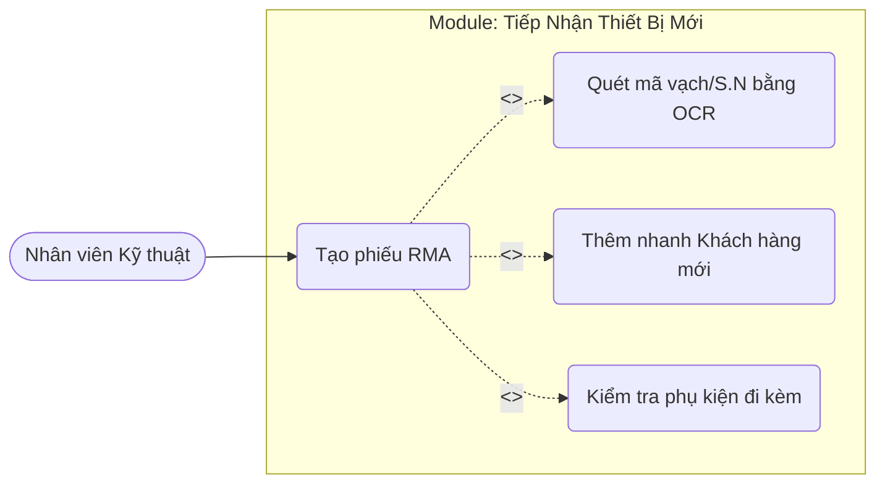

# 1. Sơ Đồ & Đặc Tả Use Case: Tiếp Nhận Thiết Bị (UC01)

## A. Sơ đồ Use Case (Phân rã chức năng Tiếp Nhận)

## B. Đặc tả Use Case (Use Case Specification)

*Đặc tả này đóng vai trò như một "hợp đồng" để lập trình viên (hoặc AI) tuân thủ khi viết code API và UI.*

* **Tên Use Case:** UC01 - Tạo phiếu RMA (Tiếp nhận thiết bị).
* **Tác nhân (Actor):** Nhân viên Kỹ thuật (Staff).
* **Tiền điều kiện (Pre-conditions):** Nhân viên đã đăng nhập vào hệ thống qua Blazor WebAssembly và có Token JWT hợp lệ.
* **Luồng cơ bản (Main Flow):**
1. Nhân viên truy cập trang `RmaTicketCreate.razor`.
2. Nhân viên kích hoạt tính năng quét OCR bằng Camera/Upload ảnh.
3. Hệ thống gọi API OCR, trả về chuỗi Serial Number (S/N) và tự động điền vào Form.
4. Nhân viên chọn Khách hàng (Customer) từ danh sách Dropdown.
5. Nhân viên nhập "Mô tả lỗi" và tích chọn "Phụ kiện đi kèm" (Sạc, Cáp...).
6. Nhân viên nhấn [Lưu Phiếu].
7. Blazor Client gửi HTTP POST (chứa `RmaTicketCreateDto`) lên ASP.NET Core API.
8. Hệ thống lưu vào Database và trả về ID phiếu mới.

* **Luồng rẽ nhánh (Alternate Flow):**
* *4a. Khách hàng chưa tồn tại:* Nhân viên nhấn nút [+] để mở Modal `CustomerDialog.razor` -> Điền thông tin -> Lưu -> Hệ thống tự động chọn Khách hàng vừa tạo vào Form hiện tại.
* *3a. Nhận diện OCR thất bại:* Cảnh báo lỗi hiển thị, nhân viên nhập S/N bằng tay.
